# Arquitectura del Sistema - Vector Database RAG

Este documento describe la arquitectura completa del sistema, incluyendo todos los pipelines de procesamiento, conexiones a bases de datos, validaciones y modelos LLM utilizados.

## Diagrama de Flujo del Sistema

```mermaid
flowchart TD
    %% ========== INICIO DEL SISTEMA ==========
    Start([Inicio del Sistema])
    Start --> InitDB[Inicializar MongoDB]
    Start --> InitQdrant[Inicializar Qdrant]
    Start --> InitRedis[Inicializar Redis]
    InitDB --> ServerReady[Servidor Listo]
    InitQdrant --> ServerReady
    InitRedis --> ServerReady

    %% ========== PIPELINE DE AUTENTICACIÓN ==========
    ServerReady --> AuthFlow{Request entrante}
    AuthFlow -->|Login/Register| AuthRequest[POST /api/auth/login]
    AuthRequest --> AuthValidate[Validar Credenciales]
    AuthValidate --> AuthDB[(MongoDB: Users)]
    AuthDB -->|Usuario válido| AuthJWT[Generar JWT Token]
    AuthJWT --> AuthResponse[Retornar Token]
    
    AuthFlow -->|Request Protegido| CheckToken{Verificar JWT}
    CheckToken -->|Sin token| AuthError[401: Token requerido]
    CheckToken -->|Token inválido| AuthError
    CheckToken -->|Token válido| AuthVerify[Verificar Usuario en DB]
    AuthVerify --> AuthDB2[(MongoDB: Users)]
    AuthDB2 -->|Usuario encontrado| AuthSuccess[Usuario autenticado]
    AuthDB2 -->|Usuario no encontrado| AuthError

    %% ========== PIPELINE DE UPLOAD DE PDF ==========
    AuthSuccess --> RateLimit1{Rate Limit Global}
    RateLimit1 -->|Excedido| RateLimitError[429: Rate limit excedido]
    RateLimit1 -->|OK| UploadRoute[POST /api/pdf/upload]
    UploadRoute --> RateLimit2{Rate Limit Usuario}
    RateLimit2 -->|Excedido| RateLimitError
    RateLimit2 -->|OK| MulterMiddleware[Multer Middleware]
    MulterMiddleware --> ValidateType{Tipo PDF válido?}
    ValidateType -->|No| UploadError[400: Solo PDFs permitidos]
    ValidateType -->|Sí| ValidateSize{Tamaño < 50MB?}
    ValidateSize -->|No| UploadError
    ValidateSize -->|Sí| Sanitize[MongoDB Sanitize]
    Sanitize --> SecurityLogger[Security Logger]
    SecurityLogger --> SaveFile[Guardar archivo en /uploads]
    SaveFile --> SavePDFMeta[Guardar metadata en MongoDB]
    SavePDFMeta --> PDFDB[(MongoDB: PDFs<br/>status: uploaded)]
    PDFDB --> UploadResponse[201: PDF subido correctamente]

    %% ========== PIPELINE DE PROCESAMIENTO DE PDF ==========
    UploadResponse --> ProcessRoute[POST /api/pdf/process/:id]
    ProcessRoute --> ValidateId1[Validar ObjectId]
    ValidateId1 -->|Inválido| ProcessError[400: ID inválido]
    ValidateId1 -->|Válido| RateLimit3{Rate Limit Usuario}
    RateLimit3 -->|Excedido| RateLimitError
    RateLimit3 -->|OK| FindPDF[Buscar PDF en MongoDB]
    FindPDF --> PDFDB2[(MongoDB: PDFs)]
    PDFDB2 -->|No encontrado| ProcessError
    PDFDB2 -->|Encontrado| UpdateStatus1[Actualizar status: processing]
    UpdateStatus1 --> PDFDB3[(MongoDB: PDFs)]
    UpdateStatus1 --> WorkerPool[Worker Pool - Piscina]
    WorkerPool --> WorkerThread[Worker Thread]
    WorkerThread --> ReadPDF[Leer archivo PDF]
    ReadPDF --> PDFParse[PDF Parse - Extraer texto]
    PDFParse --> CleanText[Limpiar texto]
    CleanText --> CreateChunks[Crear Chunks<br/>Tamaño: 1200 chars<br/>Overlap: 200 chars]
    CreateChunks --> CalcPages[Calcular número de página]
    CalcPages --> DeleteOldChunks[Eliminar chunks antiguos del PDF]
    DeleteOldChunks --> CHUNKDB1[(MongoDB: Chunks)]
    DeleteOldChunks --> BatchInsert[Insertar chunks en lotes<br/>Batch: 100]
    BatchInsert --> CHUNKDB2[(MongoDB: Chunks<br/>status: chunked<br/>content, page, index)]
    BatchInsert --> UpdateStatus2[Actualizar PDF status: processed]
    UpdateStatus2 --> PDFDB4[(MongoDB: PDFs)]
    UpdateStatus2 --> InvalidateCache1[Invalidar caché RAG del PDF]
    InvalidateCache1 --> REDIS1[(Redis: Caché RAG)]
    InvalidateCache1 --> ProcessResponse[200: PDF procesado]

    %% ========== PIPELINE DE EMBEDDING ==========
    ProcessResponse --> EmbedRoute[POST /api/pdf/embed/:id]
    EmbedRoute --> ValidateId2[Validar ObjectId]
    ValidateId2 -->|Inválido| EmbedError[400: ID inválido]
    ValidateId2 -->|Válido| FindPDF2[Buscar PDF en MongoDB]
    FindPDF2 --> PDFDB5[(MongoDB: PDFs)]
    PDFDB5 -->|No encontrado| EmbedError
    PDFDB5 -->|Encontrado| FindChunks[Buscar chunks: status='chunked']
    FindChunks --> CHUNKDB3[(MongoDB: Chunks)]
    CHUNKDB3 -->|Sin chunks| EmbedResponse[200: Sin chunks para embeder]
    CHUNKDB3 -->|Chunks encontrados| ProcessBatch[Procesar en lotes<br/>Batch: 50 chunks]
    ProcessBatch --> PreprocessText[Preprocesar texto<br/>Límite: 8000 chars]
    PreprocessText --> EmbedBatch[OpenAI Embeddings<br/>Model: text-embedding-3-small<br/>Dimensiones: 1536]
    EmbedBatch --> OPENAI1[OpenAI API]
    OPENAI1 -->|Vectores| CreatePoints[Crear puntos Qdrant<br/>Vector + payload]
    CreatePoints --> UpsertQdrant[Upsert en Qdrant]
    UpsertQdrant --> QDRANT[(Qdrant: pdf_chunks<br/>Colección: pdf_chunks<br/>Distance: Cosine)]
    UpsertQdrant --> UpdateChunkStatus[Actualizar chunks: status='embedded']
    UpdateChunkStatus --> CHUNKDB4[(MongoDB: Chunks)]
    UpdateChunkStatus --> InvalidateCache2[Invalidar caché RAG del PDF]
    InvalidateCache2 --> REDIS2[(Redis: Caché RAG)]
    InvalidateCache2 --> EmbedResponse2[200: Chunks embedidos]

    %% ========== PIPELINE DE RAG QUERY ==========
    EmbedResponse2 --> RAGRoute[POST /api/rag/query]
    RAGRoute --> ValidateRAG[Validar: pdfId + question<br/>question: 3-1000 chars]
    ValidateRAG -->|Inválido| RAGError[400: Validación fallida]
    ValidateRAG -->|Válido| RateLimit4{Rate Limit Usuario}
    RateLimit4 -->|Excedido| RateLimitError
    RateLimit4 -->|OK| CheckCacheResponse{Verificar caché<br/>respuesta completa}
    CheckCacheResponse --> REDIS3[(Redis: Caché RAG<br/>TTL: 24h)]
    REDIS3 -->|Cache hit| RAGCacheHit[Respuesta desde caché]
    RAGCacheHit --> RAGResponse[200: Respuesta RAG]
    
    CheckCacheResponse -->|Cache miss| CheckEmbedCache{Verificar caché<br/>embedding pregunta}
    CheckEmbedCache --> REDIS4[(Redis: Caché Embeddings<br/>TTL: 7 días)]
    REDIS4 -->|Cache hit| UseCachedEmbed[Usar embedding cacheado]
    REDIS4 -->|Cache miss| GenerateEmbed[Generar embedding pregunta]
    GenerateEmbed --> OPENAI2[OpenAI API<br/>Model: text-embedding-3-small]
    OPENAI2 -->|Vector 1536D| SaveEmbedCache[Guardar embedding en caché]
    SaveEmbedCache --> REDIS5[(Redis: Caché Embeddings)]
    SaveEmbedCache --> UseCachedEmbed
    
    UseCachedEmbed --> SearchQdrant[Búsqueda en Qdrant<br/>Limit: 20<br/>Score threshold: 0.5<br/>Filter: pdfId]
    SearchQdrant --> QDRANT2[(Qdrant: pdf_chunks)]
    QDRANT2 -->|Vectores similares| GetChunkIds[Obtener chunkIds de resultados]
    GetChunkIds --> FindChunksMongo[Buscar chunks en MongoDB<br/>Ordenar por index]
    FindChunksMongo --> CHUNKDB5[(MongoDB: Chunks)]
    CHUNKDB5 -->|Chunks encontrados| BuildContext[Construir contexto<br/>Max: 4000 chars<br/>Fallback: 8000 chars]
    BuildContext --> CheckEmptyContext{Contexto vacío?}
    CheckEmptyContext -->|Sí| FallbackChunks[Buscar primeros chunks<br/>o chunks con keywords]
    FallbackChunks --> CHUNKDB6[(MongoDB: Chunks)]
    CHUNKDB6 --> BuildContext
    CheckEmptyContext -->|No| CreatePrompt[Crear prompt con contexto]
    CreatePrompt --> CallLLM[LLM Completion<br/>OpenAI GPT-4o-mini<br/>Temperature: 0.2]
    CallLLM --> OPENAI3[OpenAI API]
    OPENAI3 -->|Respuesta| SaveRAGCache[Guardar respuesta en caché]
    SaveRAGCache --> REDIS6[(Redis: Caché RAG)]
    SaveRAGCache --> FormatResponse[Formatear respuesta<br/>answer + context]
    FormatResponse --> RAGResponse

    %% ========== ESTILOS ==========
    classDef dbStyle fill:#4a90e2,stroke:#2c5aa0,stroke-width:2px,color:#fff
    classDef llmStyle fill:#10a37f,stroke:#0d7c5f,stroke-width:2px,color:#fff
    classDef errorStyle fill:#e74c3c,stroke:#c0392b,stroke-width:2px,color:#fff
    classDef validationStyle fill:#f39c12,stroke:#d68910,stroke-width:2px,color:#fff
    classDef cacheStyle fill:#9b59b6,stroke:#7d3c98,stroke-width:2px,color:#fff
    classDef processStyle fill:#3498db,stroke:#2980b9,stroke-width:2px,color:#fff

    class PDFDB,PDFDB2,PDFDB3,PDFDB4,PDFDB5,CHUNKDB1,CHUNKDB2,CHUNKDB3,CHUNKDB4,CHUNKDB5,CHUNKDB6,AuthDB,AuthDB2 dbStyle
    class OPENAI1,OPENAI2,OPENAI3,EmbedBatch,CallLLM llmStyle
    class UploadError,ProcessError,EmbedError,RAGError,AuthError,RateLimitError errorStyle
    class ValidateType,ValidateSize,ValidateId1,ValidateId2,ValidateRAG,CheckToken,AuthValidate validationStyle
    class REDIS1,REDIS2,REDIS3,REDIS4,REDIS5,REDIS6,CheckCacheResponse,CheckEmbedCache,SaveEmbedCache,SaveRAGCache cacheStyle
    class WorkerPool,WorkerThread,ProcessBatch,BatchInsert,CreateChunks,PreprocessText processStyle
```



## Descripción de Componentes

### Bases de Datos

1. **MongoDB**
   - **Colección: Users** - Información de usuarios y autenticación
   - **Colección: PDFs** - Metadata de archivos PDF subidos (status: uploaded, processing, processed, error)
   - **Colección: Chunks** - Fragmentos de texto extraídos de PDFs (status: chunked, embedded)
   - **Colección: Metrics** - Métricas del sistema

2. **Qdrant (Vector Database)**
   - **Colección: pdf_chunks** - Almacena vectores de embeddings
   - **Dimensiones:** 1536 (text-embedding-3-small)
   - **Distancia:** Cosine similarity
   - **Payload:** pdfId, chunkId, index, page, content

3. **Redis (Caché)**
   - **Caché de Embeddings** - TTL: 7 días
   - **Caché de Respuestas RAG** - TTL: 24 horas

### Modelos LLM Utilizados

1. **OpenAI text-embedding-3-small**
   - **Uso:** Generación de embeddings
   - **Dimensiones:** 1536
   - **Usado en:**
     - Embedding de chunks de PDFs
     - Embedding de preguntas en RAG queries

2. **OpenAI gpt-4o-mini**
   - **Uso:** Generación de respuestas en RAG
   - **Temperature:** 0.2 (baja para respuestas más determinísticas)
   - **Contexto:** Hasta 4000 caracteres de chunks relevantes

### Pipelines Detallados

#### 1. Pipeline de Autenticación
- Login con credenciales
- Validación en MongoDB
- Generación de JWT
- Middleware de verificación en cada request protegido

#### 2. Pipeline de Upload de PDF
1. Validación de autenticación
2. Rate limiting (global y por usuario)
3. Validación de tipo de archivo (solo PDF)
4. Validación de tamaño (máx 50MB)
5. Sanitización MongoDB
6. Guardado en disco (`/uploads`)
7. Guardado de metadata en MongoDB

#### 3. Pipeline de Procesamiento de PDF
1. Validación de ID y rate limiting
2. Actualización de status a "processing"
3. Procesamiento en Worker Thread (Piscina)
   - Lectura del PDF
   - Extracción de texto (pdf-parse)
   - Limpieza de texto
   - Chunking (1200 chars, overlap 200)
   - Cálculo de página por chunk
4. Eliminación de chunks antiguos
5. Inserción de nuevos chunks en MongoDB (lotes de 100)
6. Actualización de status a "processed"
7. Invalidación de caché RAG

#### 4. Pipeline de Embedding
1. Validación de ID
2. Búsqueda de chunks con status "chunked"
3. Procesamiento en lotes (50 chunks)
4. Preprocesamiento de texto (límite 8000 chars)
5. Generación de embeddings (OpenAI text-embedding-3-small)
6. Creación de puntos para Qdrant
7. Upsert en Qdrant con vectores
8. Actualización de status a "embedded"
9. Invalidación de caché RAG

#### 5. Pipeline de RAG Query
1. Validación de entrada (pdfId + question)
2. Rate limiting por usuario
3. Verificación de caché de respuesta completa
4. Verificación de caché de embedding de pregunta
5. Si no hay caché: generación de embedding
6. Búsqueda vectorial en Qdrant (top 20, threshold 0.5)
7. Obtención de chunks relevantes de MongoDB
8. Construcción de contexto (máx 4000 chars)
9. Fallback si no hay contexto (primeros chunks o keywords)
10. Creación de prompt con contexto
11. Llamada a LLM (GPT-4o-mini)
12. Guardado en caché
13. Retorno de respuesta

### Validaciones y Seguridad

- **Autenticación JWT:** Verificación en cada request protegido
- **Rate Limiting:** 
  - Global: 200 req/min
  - Por usuario: Límites específicos por operación
- **Validación de Archivos:** 
  - Tipo: Solo PDF
  - Tamaño: Máximo 50MB
- **Validación de Datos:**
  - ObjectId de MongoDB
  - Longitud de strings (question: 3-1000 chars)
  - Sanitización MongoDB (prevención NoSQL injection)
- **Seguridad:**
  - Helmet (headers HTTP seguros)
  - CORS configurado
  - Security Logger
  - Sanitización de inputs

### Optimizaciones de Memoria

- **Worker Threads:** Procesamiento de PDFs fuera del hilo principal
- **Procesamiento en Lotes:**
  - Chunks: 100 por lote en MongoDB
  - Embeddings: 50 por lote para Qdrant
- **Caché:** Redis para embeddings y respuestas RAG
- **Cursors:** Lectura de chunks con cursor para evitar cargar todo en memoria
- **Limpieza de Memoria:** Liberación explícita de referencias grandes

## Variables de Entorno Importantes

```
# Bases de Datos
DB_URL=mongodb://localhost:27017/vector-rag
QDRANT_URL=http://localhost:6333
REDIS_URL=redis://localhost:6379

# OpenAI
OPENAI_API_KEY=sk-...
EMBEDDING_MODEL=text-embedding-3-small

# Límites y Configuración
PDF_MAX_FILE_SIZE_MB=50
PDF_WORKER_THREADS=2
PDF_BATCH_SIZE=100
QDRANT_BATCH_SIZE=50
RAG_SEARCH_LIMIT=20
RAG_SCORE_THRESHOLD=0.5
RAG_MAX_CONTEXT_LENGTH=4000

# Caché
CACHE_ENABLED=true
CACHE_TTL_EMBEDDING=604800  # 7 días
CACHE_TTL_RAG_RESPONSE=86400  # 24 horas

# Rate Limiting
RATE_LIMIT_WINDOW_MS=60000
RATE_LIMIT_MAX_REQUESTS=200
```

