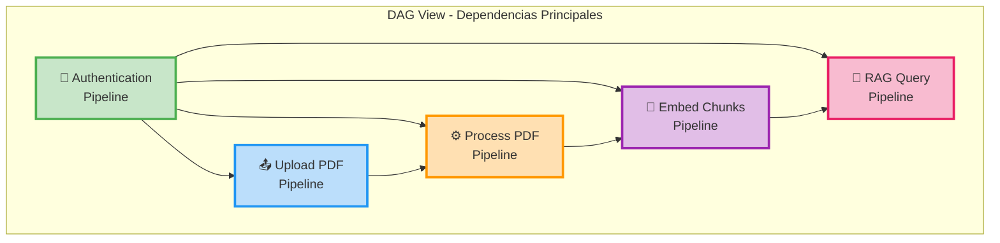

# Pipelines DAG - Flujo de Datos del Sistema

Este documento presenta un diagrama DAG (Directed Acyclic Graph) que muestra todos los pipelines del sistema, sus dependencias y el flujo de datos entre componentes.


## Diagrama DAG Estilo Airflow - Vista Horizontal

Este diagrama muestra cada pipeline como una línea horizontal de tareas, similar a la visualización de Airflow DAGs, donde las tareas fluyen de izquierda a derecha.

```mermaid
flowchart LR
    %% ========== PIPELINE DE AUTENTICACIÓN ==========
    subgraph AUTH_LINE[" "]
        direction LR
        A1["auth_request<br/>📥"] --> A2["validate_credentials<br/>✅"]
        A2 --> A3["db_users<br/>🗄️"]
        A3 --> A4["generate_jwt<br/>🔑"]
        A4 --> A5["auth_complete<br/>✅"]
    end

    %% ========== PIPELINE DE UPLOAD PDF ==========
    subgraph UPLOAD_LINE[" "]
        direction LR
        U1["upload_request<br/>📤"] --> U2{"auth_check<br/>🔍"}
        U2 -->|✓| U3["validate_pdf<br/>✅"]
        U2 -->|✗| UE["error_auth<br/>❌"]
        U3 --> U4["save_file<br/>💾"]
        U4 --> U5["save_metadata<br/>📝"]
        U5 --> U6["db_pdfs<br/>🗄️"]
        U6 --> U7["upload_complete<br/>✅"]
    end

    %% ========== PIPELINE DE PROCESAMIENTO PDF ==========
    subgraph PROCESS_LINE[" "]
        direction LR
        P1["process_request<br/>⚙️"] --> P2{"auth_check<br/>🔍"}
        P2 -->|✓| P3["worker_pool<br/>👷"]
        P2 -->|✗| PE["error_auth<br/>❌"]
        P3 --> P4["extract_text<br/>📄"]
        P4 --> P5["create_chunks<br/>✂️"]
        P5 --> P6["calc_pages<br/>📑"]
        P6 --> P7["save_chunks<br/>💾"]
        P7 --> P8["db_chunks<br/>🗄️"]
        P8 --> P9["invalidate_cache<br/>🗑️"]
        P9 --> P10["redis_cache<br/>🔴"]
        P10 --> P11["process_complete<br/>✅"]
    end

    %% ========== PIPELINE DE EMBEDDING ==========
    subgraph EMBED_LINE[" "]
        direction LR
        E1["embed_request<br/>🧮"] --> E2{"auth_check<br/>🔍"}
        E2 -->|✓| E3["load_chunks<br/>📥"]
        E2 -->|✗| EE["error_auth<br/>❌"]
        E3 --> E4["db_chunks_read<br/>🗄️"]
        E4 --> E5["process_batch<br/>📦"]
        E5 --> E6["preprocess_text<br/>🔧"]
        E6 --> E7["openai_embed<br/>🤖"]
        E7 --> E8["qdrant_upsert<br/>💾"]
        E8 --> E9["qdrant_db<br/>🔵"]
        E9 --> E10["update_status<br/>📝"]
        E10 --> E11["db_chunks_update<br/>🗄️"]
        E11 --> E12["invalidate_cache<br/>🗑️"]
        E12 --> E13["redis_cache<br/>🔴"]
        E13 --> E14["embed_complete<br/>✅"]
    end

    %% ========== PIPELINE DE RAG QUERY ==========
    subgraph RAG_LINE[" "]
        direction LR
        R1["rag_request<br/>🤖"] --> R2{"auth_check<br/>🔍"}
        R2 -->|✓| R3["validate_input<br/>✅"]
        R2 -->|✗| RE["error_auth<br/>❌"]
        R3 --> R4{"check_cache<br/>🔍"}
        R4 -->|Hit| R5["redis_resp<br/>🔴"]
        R5 --> R17["rag_complete<br/>✅"]
        R4 -->|Miss| R6{"check_embed_cache<br/>🔍"}
        R6 -->|Hit| R7["redis_embed<br/>🔴"]
        R6 -->|Miss| R8["generate_embed<br/>🧮"]
        R8 --> R9["openai_embed_api<br/>🤖"]
        R9 --> R7
        R7 --> R10["qdrant_search<br/>🔍"]
        R10 --> R11["qdrant_db<br/>🔵"]
        R11 --> R12["get_chunks<br/>📥"]
        R12 --> R13["db_chunks<br/>🗄️"]
        R13 --> R14["build_context<br/>📝"]
        R14 --> R15["gpt4_completion<br/>🤖"]
        R15 --> R16["save_cache<br/>💾"]
        R16 --> R5
    end

    %% ========== DEPENDENCIAS ENTRE PIPELINES ==========
    A5 -.->|requires| U1
    A5 -.->|requires| P1
    A5 -.->|requires| E1
    A5 -.->|requires| R1

    U7 -.->|triggers| P1
    P11 -.->|triggers| E1
    E14 -.->|enables| R1

    %% ========== ESTILOS ==========
    classDef authTask fill:#c8e6c9,stroke:#4caf50,stroke-width:2px
    classDef uploadTask fill:#bbdefb,stroke:#2196f3,stroke-width:2px
    classDef processTask fill:#ffe0b2,stroke:#ff9800,stroke-width:2px
    classDef embedTask fill:#e1bee7,stroke:#9c27b0,stroke-width:2px
    classDef ragTask fill:#f8bbd0,stroke:#e91e63,stroke-width:2px
    classDef dbTask fill:#90caf9,stroke:#1976d2,stroke-width:2px
    classDef llmTask fill:#81c784,stroke:#388e3c,stroke-width:2px
    classDef errorTask fill:#ffcdd2,stroke:#d32f2f,stroke-width:2px
    classDef decisionTask fill:#f5f5f5,stroke:#616161,stroke-width:2px
    classDef cacheTask fill:#ce93d8,stroke:#7b1fa2,stroke-width:2px
    classDef completeTask fill:#a5d6a7,stroke:#388e3c,stroke-width:3px

    class A1,A2,A3,A4 authTask
    class U1,U3,U4,U5 uploadTask
    class P1,P3,P4,P5,P6,P7 processTask
    class E1,E3,E5,E6,E7,E8 embedTask
    class R1,R3,R8,R10,R12,R14 ragTask
    class A3,U6,E4,E9,E11,R11,R13 dbTask
    class E7,R9,R15 llmTask
    class UE,PE,EE,RE errorTask
    class U2,P2,E2,R2,R4,R6 decisionTask
    class P9,P10,E12,E13,R5,R7,R16 cacheTask
    class A5,U7,P11,E14,R17 completeTask
```



### Vista Simplificada de Dependencias entre Pipelines



## Descripción de Dependencias del DAG

### Orden de Ejecución de Pipelines

1. **Pipeline de Autenticación** (Sin dependencias)
   - Genera tokens JWT necesarios para todos los demás pipelines

2. **Pipeline de Upload de PDF** (Depende de: Autenticación)
   - Requiere token JWT válido
   - Crea registro en MongoDB con status "uploaded"

3. **Pipeline de Procesamiento de PDF** (Depende de: Autenticación, Upload)
   - Requiere token JWT válido
   - Requiere PDF subido previamente
   - Genera chunks y los guarda en MongoDB

4. **Pipeline de Embedding** (Depende de: Autenticación, Procesamiento)
   - Requiere token JWT válido
   - Requiere chunks procesados (status: "chunked")
   - Genera vectores y los almacena en Qdrant

5. **Pipeline de RAG Query** (Depende de: Autenticación, Embedding)
   - Requiere token JWT válido
   - Requiere vectores almacenados en Qdrant
   - Puede ejecutarse múltiples veces independientemente

### Flujos de Datos

#### Flujo 1: Preparación de Documento
```
Auth → Upload PDF → Process PDF → Embed Chunks
```
- **Entrada:** Archivo PDF
- **Salida:** Vectores indexados en Qdrant listos para búsqueda

#### Flujo 2: Consulta RAG
```
Auth → RAG Query → [Cache Check] → [Embedding] → [Qdrant Search] → [LLM] → Response
```
- **Entrada:** Pregunta del usuario + pdfId
- **Salida:** Respuesta generada por LLM

### Dependencias de Datos

```
MongoDB: PDFs (uploaded)
    ↓
MongoDB: PDFs (processed) + Chunks (chunked)
    ↓
MongoDB: Chunks (embedded) + Qdrant: Vectores
    ↓
[Disponible para consultas RAG]
```

### Componentes Críticos por Pipeline

#### 1. Autenticación
- **Input:** Credenciales (email, password)
- **Output:** JWT Token
- **Storage:** MongoDB (Users)
- **Sin dependencias externas**

#### 2. Upload PDF
- **Input:** Archivo PDF + JWT Token
- **Output:** PDF metadata en MongoDB
- **Storage:** 
  - Disco: `/uploads/`
  - MongoDB: PDFs collection
- **Dependencias:** Autenticación

#### 3. Procesamiento PDF
- **Input:** PDF ID + JWT Token
- **Output:** Chunks de texto en MongoDB
- **Storage:** MongoDB (Chunks)
- **Dependencias:** 
  - Autenticación
  - PDF upload previo
- **Procesamiento:** Worker Threads (Piscina)

#### 4. Embedding
- **Input:** PDF ID + JWT Token
- **Output:** Vectores en Qdrant
- **Storage:** 
  - Qdrant (vectores)
  - MongoDB (chunks actualizados)
- **Dependencias:**
  - Autenticación
  - Chunks procesados
- **Procesamiento:** OpenAI Embeddings API

#### 5. RAG Query
- **Input:** pdfId + question + JWT Token
- **Output:** Respuesta generada
- **Storage:** 
  - Redis (caché de respuestas y embeddings)
- **Dependencias:**
  - Autenticación
  - Vectores en Qdrant
  - Chunks en MongoDB
- **Procesamiento:** 
  - OpenAI Embeddings API (si no hay caché)
  - Qdrant Vector Search
  - OpenAI GPT-4o-mini

## Matriz de Dependencias

| Pipeline | Depende de | Proporciona datos a | Ejecutable en paralelo |
|----------|-----------|---------------------|------------------------|
| Autenticación | Ninguno | Todos | ✅ Sí (múltiples usuarios) |
| Upload PDF | Autenticación | Procesamiento | ✅ Sí (múltiples PDFs) |
| Procesamiento PDF | Autenticación, Upload | Embedding | ⚠️ Por PDF (worker pool) |
| Embedding | Autenticación, Procesamiento | RAG Query | ⚠️ Por PDF (batch processing) |
| RAG Query | Autenticación, Embedding | Ninguno | ✅ Sí (múltiples consultas) |

## Optimizaciones de Paralelismo

1. **Múltiples Uploads:** Los usuarios pueden subir múltiples PDFs en paralelo
2. **Worker Pool:** Múltiples PDFs pueden procesarse simultáneamente (hasta 2 threads)
3. **Múltiples Queries RAG:** Varias consultas RAG pueden ejecutarse en paralelo
4. **Embedding Batch:** Procesamiento en lotes optimiza el uso de la API de OpenAI

## Puntos de Caché

1. **Caché de Embeddings (Redis):** TTL 7 días
   - Embeddings de preguntas frecuentes
   - Reduce llamadas a OpenAI

2. **Caché de Respuestas RAG (Redis):** TTL 24 horas
   - Respuestas completas para preguntas idénticas
   - Evita todo el procesamiento RAG

3. **Invalidación de Caché:**
   - Automática cuando se procesa o re-embede un PDF
   - Mantiene consistencia de datos

## Flujos de Error

Cada pipeline tiene puntos de validación que pueden generar errores:
- **Autenticación fallida:** Bloquea todos los pipelines
- **Validación de archivo fallida:** Bloquea procesamiento
- **Procesamiento fallido:** Bloquea embedding y RAG
- **Embedding fallido:** Bloquea RAG queries
- **RAG query sin datos:** Retorna fallback o error

## Métricas y Monitoreo

Cada pipeline puede ser monitoreado en:
- **MongoDB:** Estados de PDFs y Chunks
- **Qdrant:** Cantidad de vectores indexados
- **Redis:** Hit rate de caché
- **Worker Pool:** Utilización de threads

