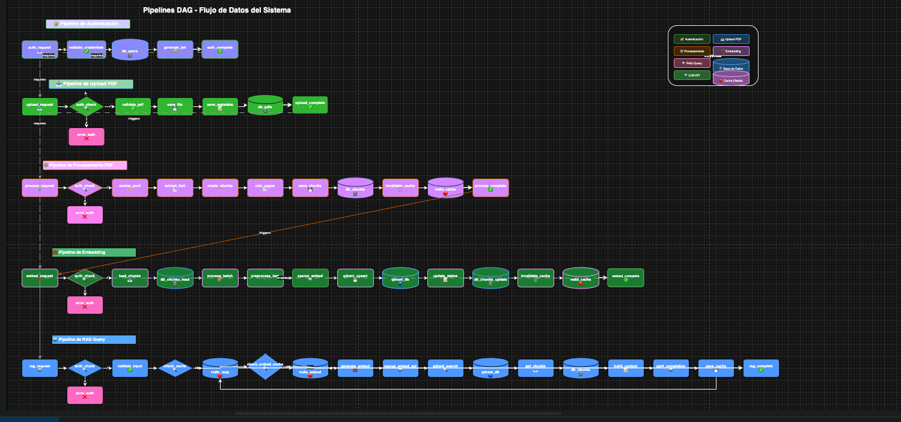

# Vector Database RAG System

Sistema de Recuperación Aumentada por Generación (RAG) utilizando bases de datos vectoriales para consultas inteligentes sobre documentos PDF.

## 🚀 Descripción

Este sistema permite procesar documentos PDF, extraer su contenido, generar embeddings vectoriales y realizar consultas inteligentes utilizando modelos de lenguaje (LLM) con contexto recuperado de manera semántica.

## 📊 Diagramas de Arquitectura



### Diagrama de Pipelines (DAG)

El sistema utiliza múltiples pipelines interconectados para procesar documentos y responder consultas. Visualiza el flujo completo en:

- **Diagrama editable**: [PIPELINES_DAG.drawio](PIPELINES_DAG.drawio) - Abre este archivo en [draw.io](https://app.diagrams.net/) o cualquier editor compatible para ver y editar el diagrama interactivo.
- **Documentación detallada**: [PIPELINES_DAG.md](PIPELINES_DAG.md) - Descripción completa de todos los pipelines y sus dependencias.
- **Arquitectura completa**: [ARCHITECTURE.md](ARCHITECTURE.md) - Documentación técnica detallada del sistema.

### Pipelines Principales

1. **🔐 Pipeline de Autenticación** - Gestión de usuarios y tokens JWT
2. **📤 Pipeline de Upload PDF** - Carga y validación de archivos PDF
3. **⚙️ Pipeline de Procesamiento PDF** - Extracción de texto y chunking
4. **🧮 Pipeline de Embedding** - Generación de vectores y almacenamiento en Qdrant
5. **🤖 Pipeline de RAG Query** - Búsqueda semántica y generación de respuestas

## 🛠️ Tecnologías

- **Backend**: Node.js + Express
- **Base de Datos**: MongoDB (metadata y chunks)
- **Base de Datos Vectorial**: Qdrant
- **Caché**: Redis
- **LLM**: OpenAI (GPT-4o-mini para respuestas, text-embedding-3-small para embeddings)
- **Procesamiento**: Worker Threads para procesamiento de PDFs

## 📋 Requisitos Previos

- Node.js >= 18.0.0
- MongoDB
- Qdrant (vector database)
- Redis (opcional, para caché)

## 🔧 Instalación

```bash
# Instalar dependencias
npm install

# Configurar variables de entorno
cp .env.example .env
# Editar .env con tus credenciales

# Crear usuario administrador
npm run create-admin
```

## 🚀 Uso

```bash
# Modo desarrollo
npm run dev

# Modo producción
npm start
```

## 📝 Documentación Adicional

- [ARCHITECTURE.md](ARCHITECTURE.md) - Arquitectura detallada del sistema
- [PIPELINES_DAG.md](PIPELINES_DAG.md) - Documentación de pipelines y flujos de datos
- [COMANDOS.md](COMANDOS.md) - Comandos útiles y referencias

## 📄 Licencia

Este proyecto está licenciado bajo MIT License con requisito de atribución. Ver [LICENSE](LICENSE) para más detalles.

## 👤 Autor

**Luis Leonidas Fernández**

---

⭐ Si encuentras útil este proyecto, no olvides mencionar al autor como colaborador según los términos de la licencia.

