# Workflow del Sistema - Vector Database RAG

Este documento describe todas las funcionalidades del sistema y sus flujos de trabajo, proporcionando una visión completa de cómo opera el sistema desde el punto de vista del usuario y técnico.

## 📋 Tabla de Contenidos

1. [Vista General del Sistema](#vista-general-del-sistema)
2. [Flujos de Autenticación](#flujos-de-autenticación)
3. [Gestión de PDFs](#gestión-de-pdfs)
4. [Sistema RAG (Consultas Inteligentes)](#sistema-rag-consultas-inteligentes)
5. [Gestión de Conversaciones](#gestión-de-conversaciones)
6. [Sesiones y Seguridad](#sesiones-y-seguridad)
7. [Métricas y Monitoreo](#métricas-y-monitoreo)
8. [Privacidad y Cumplimiento](#privacidad-y-cumplimiento)
9. [Funciones de Administración](#funciones-de-administración)
10. [Arquitectura de Datos](#arquitectura-de-datos)

---

## Vista General del Sistema

El sistema Vector Database RAG es una plataforma completa para procesar documentos PDF, generar embeddings vectoriales y realizar consultas inteligentes utilizando modelos de lenguaje con contexto recuperado semánticamente.

### Diagrama de Flujo Principal


---

## Flujos de Autenticación

### 1. Registro de Usuario

```mermaid
sequenceDiagram
    participant U as Usuario
    participant A as API
    participant DB as MongoDB
    participant E as Email Service
    
    U->>A: POST /api/auth/register<br/>(email, password, name)
    A->>A: Validar datos
    A->>DB: Verificar email único
    DB-->>A: Email disponible
    A->>A: Hash password (bcrypt)
    A->>A: Generar token verificación
    A->>DB: Crear usuario (emailVerified: false)
    A->>E: Enviar email verificación
    E-->>U: Email de verificación
    A-->>U: 201: Usuario registrado
    Note over U: Usuario debe verificar email
```



### 2. Verificación de Email


### 3. Login


### 4. Reset de Contraseña

```mermaid
flowchart TD
    A[Usuario solicita reset] --> B[POST /api/auth/request-password-reset]
    B --> C{Email válido?}
    C -->|No| D[Error 400]
    C -->|Sí| E[Buscar usuario en DB]
    E --> F{Usuario existe?}
    F -->|No| G[Retornar éxito sin revelar]
    F -->|Sí| H[Generar token seguro]
    H --> I[Guardar token en DB]
    I --> J[Enviar email con link]
    J --> K[Usuario recibe email]
    K --> L[Usuario accede a link]
    L --> M[POST /api/auth/reset-password]
    M --> N{Token válido?}
    N -->|No| O[Error: Token inválido]
    N -->|Sí| P[Hash nueva contraseña]
    P --> Q[Actualizar contraseña]
    Q --> R[Eliminar token]
    R --> S[Éxito: Contraseña actualizada]
    
    style S fill:#a5d6a7
    style O fill:#ffcdd2
```



### 5. Gestión de Perfil


---

## Gestión de PDFs

### Pipeline Completo: Upload → Process → Embed


### Listado de PDFs


### Obtener Índice del PDF


---

## Sistema RAG (Consultas Inteligentes)

### Flujo Completo de Consulta RAG

```mermaid
flowchart TD
    Start([Usuario hace pregunta]) --> Validate{Validar entrada<br/>pdfId + question<br/>3-1000 chars}
    Validate -->|Inválido| Error1[Error 400]
    Validate -->|Válido| RateLimit{Rate Limit}
    RateLimit -->|Excedido| Error2[Error 429]
    RateLimit -->|OK| CheckCache1{¿Caché de<br/>respuesta completa?}
    
    CheckCache1 -->|Hit| CacheResponse[Retornar respuesta desde caché]
    CheckCache1 -->|Miss| GetConversation{¿Conversación activa<br/>usuario + PDF?}
    
    GetConversation -->|Sí| GetMessages[Obtener mensajes anteriores<br/>contexto conversación]
    GetConversation -->|No| CreateConversation[Crear nueva conversación]
    
    GetMessages --> CheckEmbedCache{¿Caché de<br/>embedding pregunta?}
    CreateConversation --> CheckEmbedCache
    
    CheckEmbedCache -->|Hit| UseCachedEmbed[Usar embedding cacheado]
    CheckEmbedCache -->|Miss| GenerateEmbed[Generar embedding<br/>OpenAI text-embedding-3-small]
    
    GenerateEmbed --> SaveEmbedCache[Guardar embedding en caché<br/>TTL: 7 días]
    SaveEmbedCache --> UseCachedEmbed
    
    UseCachedEmbed --> SearchQdrant[Búsqueda vectorial Qdrant<br/>Limit: 20<br/>Score threshold: 0.5<br/>Filter: pdfId + tenantId]
    
    SearchQdrant --> GetChunks{¿Chunks encontrados?}
    GetChunks -->|No| FallbackChunks[Buscar primeros chunks<br/>o por keywords]
    GetChunks -->|Sí| BuildContext[Construir contexto<br/>Max: 4000 chars<br/>Fallback: 8000 chars]
    
    FallbackChunks --> BuildContext
    BuildContext --> CreatePrompt[Crear prompt completo<br/>Contexto conversación +<br/>Chunks relevantes +<br/>Pregunta actual]
    
    CreatePrompt --> CallLLM[LLM Completion<br/>OpenAI GPT-4o-mini<br/>Temperature: 0.2]
    CallLLM --> SaveMessages[Guardar mensajes<br/>user + assistant en DB]
    SaveMessages --> UpdateStats[Actualizar estadísticas<br/>tokens, costos]
    UpdateStats --> CheckSummary{¿Conversación muy larga?}
    
    CheckSummary -->|Sí| GenerateSummary[Generar resumen automático]
    CheckSummary -->|No| SaveRAGCache
    GenerateSummary --> SaveRAGCache[Guardar respuesta en caché<br/>TTL: 24 horas]
    
    SaveRAGCache --> FormatResponse[Formatear respuesta<br/>answer + context + metadata]
    FormatResponse --> Response[200: Respuesta RAG]
    CacheResponse --> Response
    
    style Response fill:#a5d6a7
    style Error1 fill:#ffcdd2
    style Error2 fill:#ffcdd2
    style CallLLM fill:#81c784
    style SearchQdrant fill:#90caf9
```



### Detalle: Construcción de Contexto


---

## Gestión de Conversaciones

### Flujo de Conversaciones RAG

```mermaid
flowchart TD
    Start([Usuario inicia conversación]) --> CheckActive{¿Conversación activa<br/>para PDF?}
    
    CheckActive -->|Sí| GetActive[Obtener conversación activa]
    CheckActive -->|No| CreateNew[Crear nueva conversación<br/>isActive: true]
    
    GetActive --> AddMessage[Agregar mensaje user]
    CreateNew --> AddMessage
    
    AddMessage --> ProcessRAG[Procesar RAG Query]
    ProcessRAG --> AddResponse[Agregar mensaje assistant]
    AddResponse --> UpdateStats[Actualizar estadísticas<br/>messageCount, totalTokens]
    
    UpdateStats --> CheckThreshold{¿Mensajes > 20?}
    CheckThreshold -->|Sí| GenerateSummary[Generar resumen<br/>automático con LLM]
    CheckThreshold -->|No| Continue[Continuar conversación]
    
    GenerateSummary --> CloseOld[Actualizar conversación<br/>isActive: false<br/>summary: generado]
    CloseOld --> CreateNew
    
    Continue --> NextQuestion{¿Siguiente pregunta?}
    NextQuestion -->|Sí| AddMessage
    NextQuestion -->|No| End([Conversación pausada])
    
    style End fill:#a5d6a7
```



### Operaciones de Conversación


---

## Sesiones y Seguridad

### Gestión de Sesiones

```mermaid
sequenceDiagram
    participant U as Usuario
    participant A as API
    participant R as Redis
    participant DB as MongoDB
    
    Note over U,DB: Login crea sesión
    U->>A: POST /api/auth/login
    A->>A: Generar JWT token
    A->>R: Crear sesión Redis<br/>Clave: session:{tenantId}:{userId}:{tokenId}<br/>TTL: 24h
    A->>DB: Registrar en LoginHistory
    A-->>U: Token JWT
    
    Note over U,DB: Listar sesiones activas
    U->>A: GET /api/sessions<br/>(con JWT token)
    A->>R: Buscar todas las sesiones<br/>del usuario
    R-->>A: Lista de sesiones activas
    A-->>U: 200: Array de sesiones<br/>{tokenId, ipAddress, userAgent, createdAt}
    
    Note over U,DB: Cerrar sesión específica
    U->>A: DELETE /api/sessions/:tokenId
    A->>R: Eliminar sesión de Redis
    A->>DB: Actualizar LoginHistory<br/>loggedOutAt, sessionDuration
    A-->>U: 200: Sesión cerrada
    
    Note over U,DB: Cerrar todas las sesiones
    U->>A: DELETE /api/sessions/all
    A->>R: Eliminar todas las sesiones<br/>del usuario
    A->>DB: Actualizar todas en LoginHistory
    A-->>U: 200: Todas las sesiones cerradas
```



### Middleware de Autenticación

```mermaid
flowchart TD
    Request[HTTP Request] --> ExtractToken{¿Header Authorization?}
    ExtractToken -->|No| Error1[401: Token requerido]
    ExtractToken -->|Sí| ValidateJWT{¿Token válido?}
    
    ValidateJWT -->|No| Error2[401: Token inválido]
    ValidateJWT -->|Sí| ExtractData[Extraer userId, tenantId]
    
    ExtractData --> CheckRedis{¿Sesión en Redis?}
    CheckRedis -->|No| Error3[401: Sesión expirada]
    CheckRedis -->|Sí| CheckDB{¿Usuario existe<br/>en MongoDB?}
    
    CheckDB -->|No| Error4[401: Usuario no encontrado]
    CheckDB -->|Sí| UpdateActivity[Actualizar lastActivityAt<br/>en Redis]
    UpdateActivity --> AttachUser[Adjuntar user al request]
    AttachUser --> Next[Continuar a endpoint]
    
    style Next fill:#a5d6a7
    style Error1 fill:#ffcdd2
    style Error2 fill:#ffcdd2
    style Error3 fill:#ffcdd2
    style Error4 fill:#ffcdd2
```



### Rate Limiting


---

## Métricas y Monitoreo

### Sistema de Métricas

```mermaid
flowchart TD
    Collect[Recopilar Métricas] --> Store[Almacenar en MongoDB<br/>Colección: Metrics]
    
    Store --> RealTime[GET /api/metrics/current]
    Store --> History[GET /api/metrics/history]
    
    RealTime --> Aggregate[Agregar métricas<br/>últimas 24 horas]
    Aggregate --> Format1[Formatear respuesta<br/>tiempo real]
    
    History --> Query{Parámetros?}
    Query -->|Sin parámetros| Last24[Últimas 24 horas]
    Query -->|Con fecha inicio| CustomRange[Rango personalizado]
    Query -->|Con intervalo| IntervalData[Datos por intervalo]
    
    Last24 --> Format2[Formatear histórico]
    CustomRange --> Format2
    IntervalData --> Format2
    
    Format1 --> Response1[200: Métricas actuales]
    Format2 --> Response2[200: Historial de métricas]
    
    style Response1 fill:#a5d6a7
    style Response2 fill:#a5d6a7
```



### Tipos de Métricas

```mermaid
mindmap
  root((Métricas del Sistema))
    Usuarios
      Total usuarios
      Usuarios activos
      Nuevos registros
    PDFs
      Total PDFs
      PDFs procesados
      PDFs embedidos
      Tamaño total almacenado
    Chunks
      Total chunks
      Chunks embedidos
      Promedio chunks por PDF
    RAG Queries
      Total consultas
      Consultas exitosas
      Tiempo promedio respuesta
      Cache hit rate
    Tokens
      Total tokens consumidos
      Costos estimados
      Tokens por consulta
    Sesiones
      Sesiones activas
      Duración promedio
      Logins totales
```



---

## Privacidad y Cumplimiento

### Flujo de Eliminación de Datos Personales

```mermaid
flowchart TD
    User[Usuario solicita eliminación] --> Request[POST /api/privacy/delete-my-data]
    Request --> Auth{Autenticado?}
    Auth -->|No| Error1[401: No autenticado]
    Auth -->|Sí| Confirm{Confirmar eliminación}
    
    Confirm --> DeletePDFs[Eliminar todos los PDFs<br/>del usuario]
    DeletePDFs --> DeleteChunks[Eliminar todos los chunks<br/>del usuario]
    DeleteChunks --> DeleteVectors[Eliminar vectores Qdrant<br/>filtro: userId]
    DeleteVectors --> DeleteConversations[Eliminar conversaciones<br/>del usuario]
    DeleteVectors --> DeleteMessages[Eliminar mensajes<br/>del usuario]
    
    DeleteMessages --> AnonymizeHistory[Anonimizar LoginHistory<br/>userId → null]
    AnonymizeHistory --> DeleteSessions[Eliminar sesiones Redis]
    DeleteSessions --> DeleteUser[Eliminar usuario<br/>de MongoDB]
    
    DeleteUser --> Success[200: Datos eliminados]
    
    style Success fill:#a5d6a7
    style Error1 fill:#ffcdd2
```



### Exportación de Datos (GDPR)


### Funciones de Admin

```mermaid
flowchart LR
    Admin[Admin autenticado] --> Export[GET /api/admin/privacy/export/:userId]
    Admin --> Delete[DELETE /api/admin/privacy/delete/:userId]
    
    Export --> GetData[Obtener todos los datos<br/>del usuario]
    GetData --> Format[Formatear para exportación]
    Format --> Download[Descargar archivo JSON]
    
    Delete --> VerifyAdmin{¿Es admin?}
    VerifyAdmin -->|No| Error1[403: No autorizado]
    VerifyAdmin -->|Sí| DeleteAll[Eliminar todos los datos<br/>del usuario]
    DeleteAll --> Success[200: Datos eliminados]
    
    style Download fill:#a5d6a9
    style Success fill:#a5d6a7
    style Error1 fill:#ffcdd2
```

---

## Arquitectura de Datos

### Estructura de Base de Datos

```mermaid
erDiagram
    TENANT ||--o{ USER : tiene
    TENANT ||--o{ PDF : tiene
    USER ||--o{ PDF : sube
    USER ||--o{ CONVERSATION : tiene
    USER ||--o{ LOGIN_HISTORY : genera
    PDF ||--o{ CHUNK : contiene
    CONVERSATION ||--o{ MESSAGE : contiene
    PDF ||--o{ CONVERSATION : referencia
    
    TENANT {
        string _id PK
        string name
        string slug UK
        object settings
        date createdAt
    }
    
    USER {
        string _id PK
        string tenantId FK
        string email UK
        string password
        string name
        string role
        boolean emailVerified
        date createdAt
    }
    
    PDF {
        string _id PK
        string tenantId FK
        string userId FK
        string filename
        string originalName
        string filePath
        number fileSize
        string status
        date uploadedAt
        date processedAt
    }
    
    CHUNK {
        string _id PK
        string tenantId FK
        string pdfId FK
        string content
        number page
        number index
        string status
    }
    
    CONVERSATION {
        string _id PK
        string tenantId FK
        string userId FK
        string pdfId FK
        string title
        boolean isActive
        number messageCount
        string summary
        number totalTokens
        number tokenCost
    }
    
    MESSAGE {
        string _id PK
        string tenantId FK
        string conversationId FK
        string role
        string content
        number index
        object metadata
    }
    
    LOGIN_HISTORY {
        string _id PK
        string tenantId FK
        string userId FK
        string tokenId
        string ipAddress
        string userAgent
        date loggedInAt
        date loggedOutAt
        number sessionDuration
    }
```

### Flujo de Datos Multi-Tenant

```mermaid
flowchart TD
    Request[HTTP Request] --> ExtractTenant{Extraer tenantId<br/>del JWT token}
    ExtractTenant --> AllQueries[Todas las consultas]
    
    AllQueries --> MongoDB[(MongoDB<br/>Filtro: tenantId)]
    AllQueries --> Qdrant[(Qdrant<br/>Filtro: tenantId en payload)]
    AllQueries --> Redis[(Redis<br/>Clave: tenantId:userId:...)]
    
    MongoDB --> Results1[Resultados filtrados]
    Qdrant --> Results2[Resultados filtrados]
    Redis --> Results3[Resultados filtrados]
    
    Results1 --> Response[Respuesta al usuario]
    Results2 --> Response
    Results3 --> Response
    
    style MongoDB fill:#90caf9
    style Qdrant fill:#90caf9
    style Redis fill:#ffcdd2
```

### Almacenamiento de Vectores en Qdrant

```mermaid
flowchart LR
    Chunk[Chunk de texto<br/>MongoDB] --> Embedding[Generar Embedding<br/>OpenAI API]
    Embedding --> Vector[Vector 1536 dimensiones]
    Vector --> Payload[Crear Payload<br/>pdfId, chunkId, index,<br/>page, content, tenantId]
    Payload --> Point[Punto Qdrant]
    Point --> Upsert[Upsert en Colección<br/>pdf_chunks<br/>Distance: Cosine]
    
    Query[Consulta RAG] --> QueryEmbedding[Embedding de pregunta]
    QueryEmbedding --> Search[Búsqueda Vectorial<br/>Filter: tenantId + pdfId<br/>Limit: 20<br/>Score > 0.5]
    Upsert -.-> Search
    Search --> Results[Top 20 chunks similares]
    Results --> Context[Construir contexto]
    
    style Upsert fill:#90caf9
    style Search fill:#81c784
```

---

## Resumen de Endpoints

### Autenticación (`/api/auth`)
- `POST /register` - Registro de usuario
- `POST /login` - Inicio de sesión
- `POST /verify-email` - Verificar email
- `POST /resend-verification` - Reenviar verificación
- `POST /request-password-reset` - Solicitar reset de contraseña
- `POST /reset-password` - Resetear contraseña
- `GET /profile` - Obtener perfil
- `PUT /profile` - Actualizar perfil

### PDFs (`/api/pdf`)
- `POST /upload` - Subir PDF
- `GET /` - Listar PDFs del usuario
- `POST /process/:id` - Procesar PDF
- `POST /embed/:id` - Generar embeddings
- `GET /:id/index` - Obtener índice del PDF

### Chunks (`/api/chunks`)
- `GET /:pdfId` - Listar chunks de un PDF

### RAG (`/api/rag`)
- `POST /query` - Consulta RAG

### Conversaciones (`/api/conversations`)
- `GET /` - Listar conversaciones
- `GET /:id` - Obtener conversación
- `GET /:id/context` - Obtener contexto
- `GET /:id/stats` - Estadísticas de tokens
- `POST /:id/close` - Cerrar conversación
- `GET /active/:pdfId` - Conversación activa

### Sesiones (`/api/sessions`)
- `GET /` - Listar sesiones activas
- `DELETE /:tokenId` - Cerrar sesión específica
- `DELETE /all` - Cerrar todas las sesiones

### Métricas (`/api/metrics`)
- `GET /current` - Métricas en tiempo real
- `GET /history` - Historial de métricas

### Privacidad (`/api/privacy`)
- `GET /my-data-summary` - Resumen de datos personales
- `DELETE /delete-my-data` - Eliminar datos personales

### Admin (`/api/admin/privacy`)
- `GET /export/:userId` - Exportar datos de usuario
- `DELETE /delete/:userId` - Eliminar datos de usuario

### Health (`/api/health`)
- `GET /` - Estado del sistema

---

## Flujo de Usuario Completo

### Escenario: Usuario nuevo procesa PDF y hace consultas RAG

```mermaid
sequenceDiagram
    participant U as Usuario
    participant A as API
    participant DB as MongoDB
    participant Q as Qdrant
    participant O as OpenAI
    participant R as Redis
    
    Note over U,R: 1. Registro y Verificación
    U->>A: POST /api/auth/register
    A->>DB: Crear usuario
    A->>U: Email de verificación
    U->>A: POST /api/auth/verify-email
    A->>DB: Marcar email verificado
    
    Note over U,R: 2. Login
    U->>A: POST /api/auth/login
    A->>DB: Validar credenciales
    A->>R: Crear sesión
    A->>U: Token JWT
    
    Note over U,R: 3. Subir PDF
    U->>A: POST /api/pdf/upload (con token)
    A->>DB: Guardar metadata (status: uploaded)
    A->>U: PDF subido (id)
    
    Note over U,R: 4. Procesar PDF
    U->>A: POST /api/pdf/process/:id
    A->>A: Worker Thread: Extraer texto
    A->>A: Crear chunks
    A->>DB: Guardar chunks (status: chunked)
    A->>DB: Actualizar PDF (status: processed)
    A->>U: PDF procesado
    
    Note over U,R: 5. Generar Embeddings
    U->>A: POST /api/pdf/embed/:id
    A->>DB: Obtener chunks
    A->>O: Generar embeddings (batch)
    O-->>A: Vectores
    A->>Q: Upsert vectores
    A->>DB: Actualizar chunks (status: embedded)
    A->>U: Embeddings generados
    
    Note over U,R: 6. Consulta RAG
    U->>A: POST /api/rag/query (pdfId + question)
    A->>R: ¿Caché?
    R-->>A: Miss
    A->>O: Embedding de pregunta
    O-->>A: Vector pregunta
    A->>Q: Búsqueda vectorial
    Q-->>A: Chunks similares
    A->>DB: Obtener chunks completos
    A->>A: Construir contexto
    A->>O: LLM Completion (GPT-4o-mini)
    O-->>A: Respuesta
    A->>DB: Guardar mensajes (conversación)
    A->>R: Guardar en caché
    A->>U: Respuesta RAG
    
    Note over U,R: 7. Más consultas (conversación)
    U->>A: POST /api/rag/query (misma conversación)
    A->>DB: Obtener conversación activa
    A->>DB: Obtener mensajes anteriores
    A->>A: Construir contexto conversación
    A->>O: LLM con contexto
    O-->>A: Respuesta contextual
    A->>U: Respuesta con contexto
```

---

## Conclusión

Este documento proporciona una visión completa de todas las funcionalidades del sistema Vector Database RAG. El sistema está diseñado con:

- ✅ **Arquitectura limpia** (Clean Architecture / Hexagonal)
- ✅ **Multi-tenancy** completo
- ✅ **Seguridad robusta** (JWT, rate limiting, sanitización)
- ✅ **Escalabilidad** (Worker threads, procesamiento en lotes, caché)
- ✅ **Cumplimiento GDPR** (eliminación y exportación de datos)
- ✅ **Monitoreo** (métricas y logging)

Para más detalles técnicos, consulta:
- [ARCHITECTURE.md](ARCHITECTURE.md) - Arquitectura técnica detallada
- [PIPELINES_DAG.md](PIPELINES_DAG.md) - Diagramas de pipelines
- [README.md](README.md) - Guía de inicio rápido

